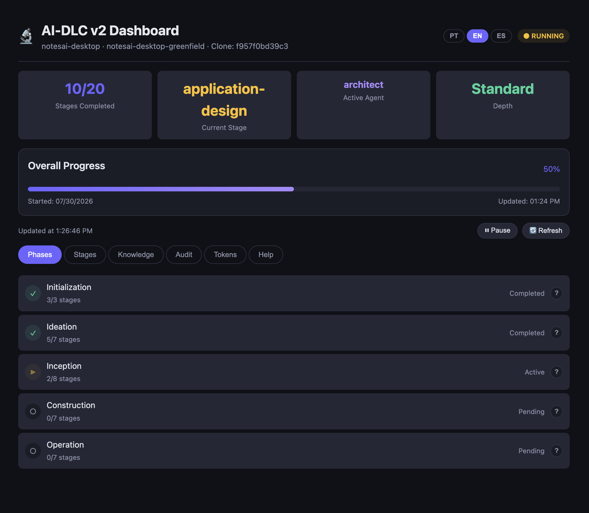
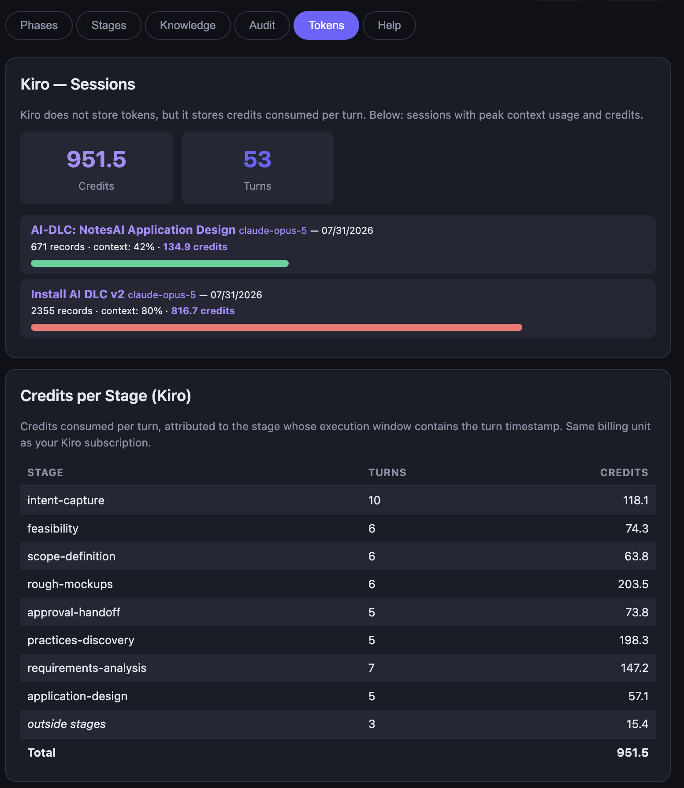

# AIDLC Dashboard

A real-time dashboard for [AI-DLC](https://github.com/awslabs/aidlc-workflows) workflows (2.0, GA on `main`). It reads the `aidlc/` folder that the AI-DLC engine writes to your project and visualizes workflow status: the workflow shape per scope, phases, stages, approval gates, learned rules, audit trail with recorded decisions, an artifact file browser (with rendered Mermaid diagrams), and consumption (tokens/credits) — including **cost per stage**.



## What's in this repo

| File | What it is |
|---|---|
| `dashboard.html` | Standalone dashboard — a single file, no install, no server |
| `aidlc-dashboard-x.y.z.vsix` | Extension for Kiro IDE / VS Code |
| `web/` | Web-server dashboard — runs in any browser via a small Node.js backend (`npm run server {path}`) |

All three render the same UI. Pick whichever fits your workflow.

## Tabs

- **Workflow** (default) — the shape of the run: which of the **33 stages** execute under the active scope (highlighted per phase, skipped ones dimmed), approval-gate counts, and the live done/current stages. Chips preview all 11 scopes.
  - **Units & Bolts** — once Units Generation produces units, the Workflow tab shows the Construction plan (units, Bolt sequence, walking skeleton); during Construction it switches to a live panel (done/running/queued/failed Bolts, per-unit progress through 3.1 → 3.5, DAG dependencies); afterwards it collapses to a read-only summary. Intents without units keep the stage grid.
- **Phases / Stages** — phase progress and per-stage status, agent and timing; click any item for details.
- **Files** — browse the `aidlc/` artifact tree and read `.md`/`.json` in place, with **Mermaid diagrams rendered inline**.
- **Knowledge** — learned decisions and NEVER/ALWAYS rules.
- **Audit** — a Recorded Decisions card (stage + rationale) plus the event timeline.
- **Tokens** — token/credit usage and cost per stage (auto-refreshing).

## Option 1 — Standalone HTML (no install)

1. Download `dashboard.html` and open it in **Chrome, Edge or Opera**
2. Click **Open aidlc Folder** and select the `aidlc/` folder of your project
3. Done — it auto-refreshes every 5 seconds while the workflow runs (token/credit data refreshes on its own timer too)

Great for following a live workflow, workshops, or sharing progress with stakeholders. UI in English, Portuguese and Spanish (auto-detected, manual selector, English fallback).

## Option 2 — Kiro IDE / VS Code extension

1. Download the `.vsix`
2. Command Palette (`Cmd/Ctrl+Shift+P`) → **Extensions: Install from VSIX**
3. Open a project containing an `aidlc/` folder and run **`AIDLC: Open Dashboard`**

No pickers needed: the extension detects the workspace automatically and refreshes instantly via file watcher.

## Option 3 — Web server (any browser)

For anyone not using Kiro, Cursor, VS Code or another editor fork: run the dashboard as a small local web app and open it in **any** modern browser (no File System Access API needed).

```bash
cd web
npm install

# Start with your project path (npm needs the `--` to forward the path)
npm run server -- /path/to/your/project

# Or start without a path — it prompts you to paste the project path
npm run server
```

Then open the URL printed in your terminal (base `http://localhost:3939`). The server auto-increments to the next free port, so you can run several projects at once (e.g. `3939`, `3940`, …). Override the base port with the `PORT` env variable. Updates are pushed **instantly over WebSocket** by a file watcher on the `aidlc/` folder — no 5-second polling. It renders the same UI (workflow, phases, stages, files, knowledge, audit, tokens) as the other two options and stays **fully local**. Requires **Node.js ≥ 18** and works in any modern browser. See [`web/README.md`](web/README.md) for the quick-start and REST API details.

## Consumption & cost per stage

The **Tokens** tab attributes consumption to each workflow stage (by matching timestamps against each stage's execution window):

- **Kiro IDE** — exact **subscription credits**: total, per session and per stage, read from the local session files (`~/.kiro/sessions/`)
- **Claude Code** — token counts and an **estimated USD cost** per stage, from local transcripts (`~/.claude/projects/`), priced by an adjustable reference table



In the standalone HTML, point the Tokens tab at your transcripts folder; the extension finds it automatically. On macOS, press `Cmd+Shift+.` in the folder picker to reveal hidden folders.

## Requirements

- An AI-DLC workflow (the dashboard reads its `aidlc/` folder) — any harness: Kiro IDE, Kiro CLI or Claude Code
- Standalone HTML: a Chromium-based browser (File System Access API)
- Extension: Kiro IDE or VS Code ≥ 1.80
- Web server: Node.js ≥ 18 and any modern browser (no File System Access API needed)

## Notes

- Everything runs **locally** — no data leaves your machine
- Workflow files are treated as untrusted input (HTML-escaped before rendering)
- USD costs for Claude Code are estimates; for exact billing on AWS Bedrock, use Cost Explorer / CloudWatch

## License

MIT
